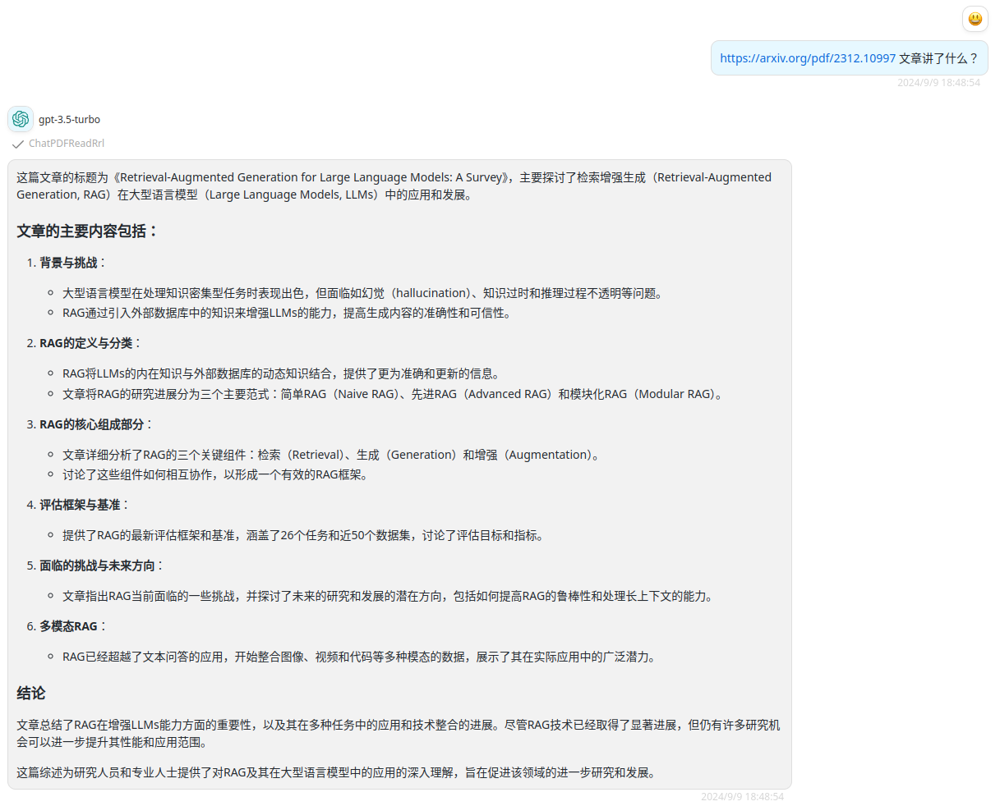

# Chat PDF GPT

> A GPT that allows the user to read data from a link.
> [PDF AI Reader Chat (4.1 ★)](https://chatgpt.com/g/g-oMM2c1bD3)

## Schema
[openapi.json](./openapi.json)

## Servers

`https://gpt.chatpdf.aidocmaker.com`

## Operations

1. ChatPDFReadRrl

## Authentication

```
type: none
```

## Preview




