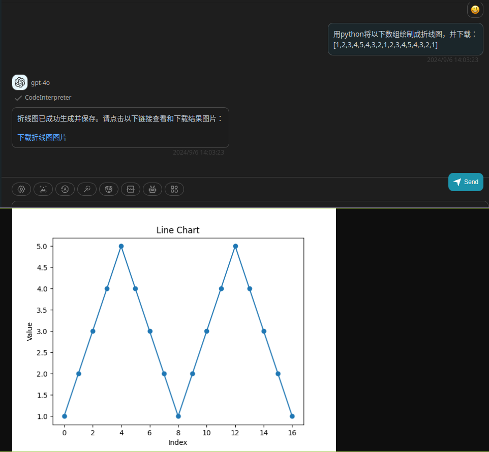

# CodeInterpreter

> Run a given Python program and return the output.

## github
https://github.com/leezhuuuuu/Code-Interpreter-Api

## Schema
[openapi.json](./openapi.json)

## Servers

`https://code.leez.tech`

## Operations

1. CodeInterpreter

## Authentication

```
type: none
```

## Preview




