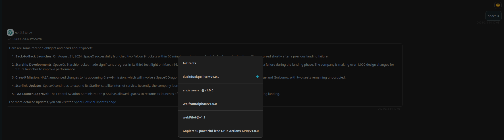

# DuckDuckGoLiteSearch

> a search engine. useful for when you need to answer questions about current events. input should be a search query.

## Schema
[openapi.json](./openapi.json)

## Servers

`https://lite.duckduckgo.com`

## Operations

1. DuckDuckGoLiteSearch
> `POST` /lite/

## Authentication
```
type: none
```

## Preview




