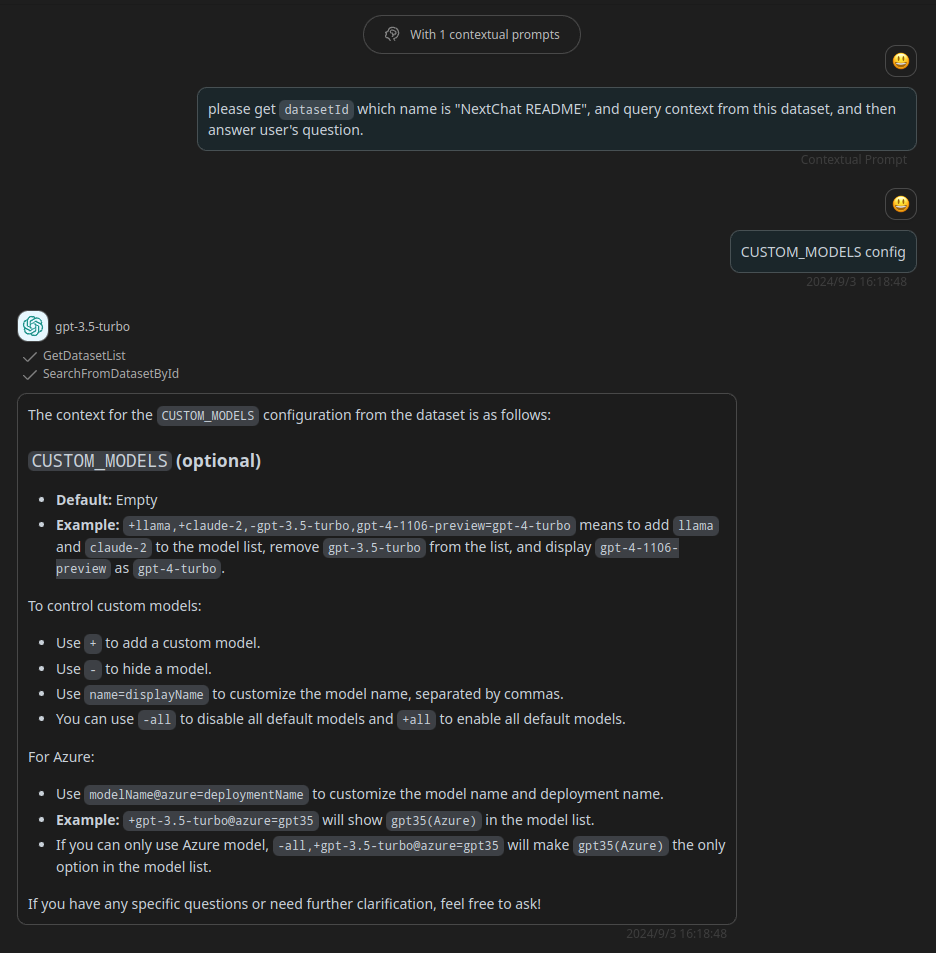

# FastGPT

> FastGPT 是一个基于 LLM 大语言模型的知识库问答系统，提供开箱即用的数据处理、模型调用等能力。同时可以通过 Flow 可视化进行工作流编排，从而实现复杂的问答场景！

## Schema
[openapi.json](./openapi.json)

## Servers

`https://api.fastgpt.in`

## Operations

1. GetDatasetList
> Get Dataset list with `id`, `name` and other info

2. SearchFromDatasetById
> search chunks from dataset by `datesetId`

## Authentication

```
type: bearer
location: header
```

## Context Prompts
```
please get `datasetId` which name is "NextChat README", and query context from this dataset, and then answer user's question.
```

## Preview




