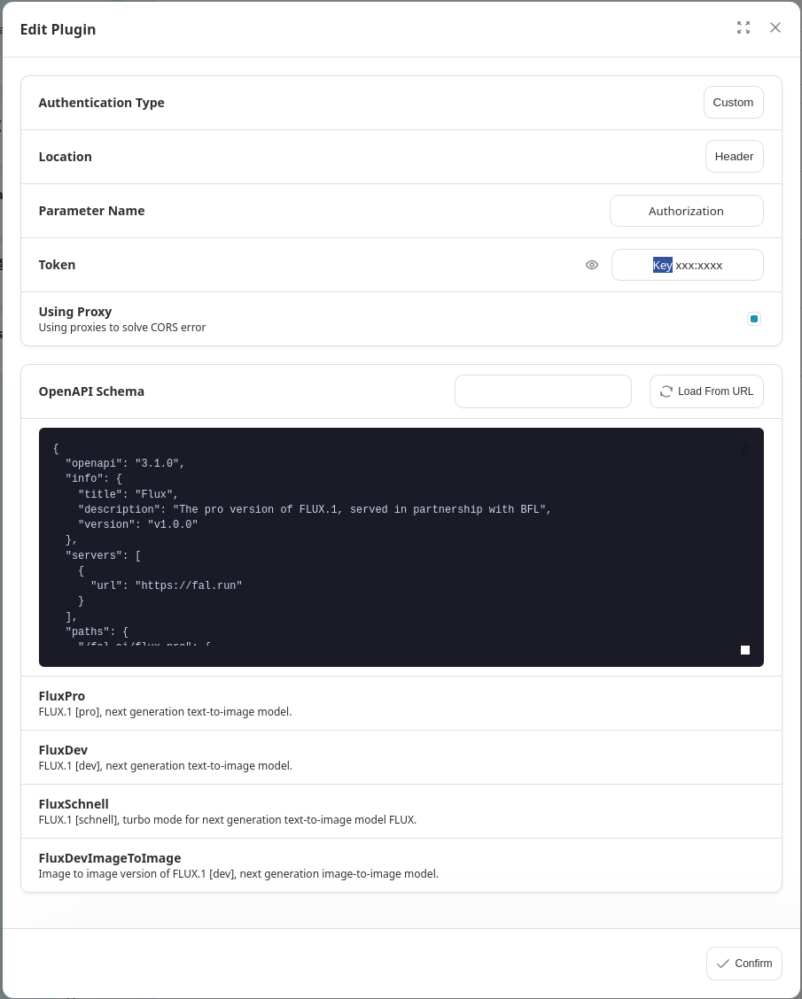

# Flux Pro

> The pro version of FLUX.1, served in partnership with BFL

## Schema
[openapi.json](./openapi.json)

## Servers

`https://fal.run`

## Operations

1. FluxPro
2. FluxDev
3. FluxSchnell
4. FluxDevImageToImage


## Authentication

```
type: custom
location: header
name: Authorization
token: Key {{apikey}}
```




## Preview


