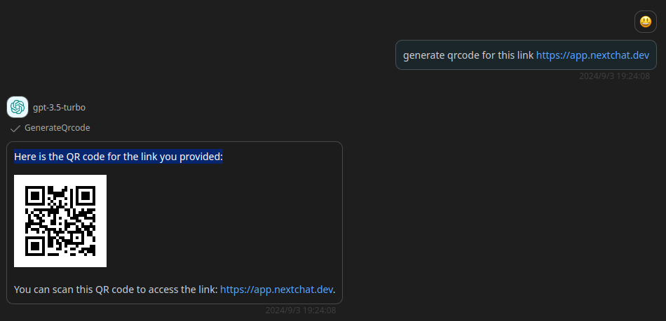

# gapier

> A free exclusive GPTs Actions API provided by gapier.com, which can be used to enhance the capabilities of GPTs. Highly recommended for ChatGPT users!"

## Schema
[openapi.json](https://a.gapier.com/free)

## Servers

`https://a.gapier.com`

## Operations

1. GetCurrentTime
2. GetLastRate
3. GetIpInfo
4. GenerateQrcode
5. GenerateRandomUser
6. SearchBook
7. SearchMovie
8. GetCryptoInformation
9. GetFestivalsInformation
10. SearchImage
11. SearchMusic
12. GetTopNews
13. GeneratePoster
14. GetWeather
15. SearchBookByGoogle
16. SendEmail
17. SearchBDomainInformation
18. GeneratesGraphVizCharts
19. GenerateQuoteCard
20. GetVideoInfo
20. GeneratesCharts
21. StoreSnapshot
22. ExtractSnapshot
23. GenerateMixedPosterImage
24. GenerateMermaidDiagram
25. GenerateMindMap
26. ReadWebpage
27. ReadArXiv
28. SearchNews
29. GoogleSearch


## Authentication

```
type: bearer
location: header
```

## Preview




