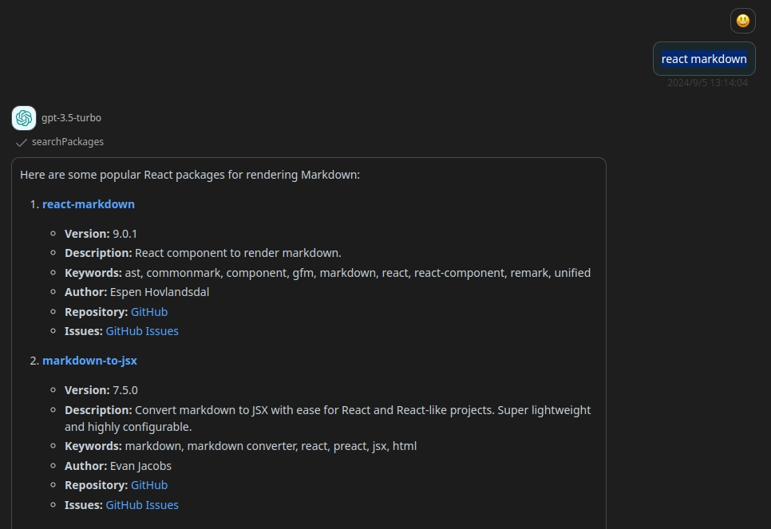

# NPM Registry Search API

> Search for packages in the NPM registry.

## Schema
[openapi.json](./openapi.json)

## Servers

`https://registry.npmjs.org`

## Operations

1. searchPackages
> Search for packages in the NPM registry
2. getPackageDetails
> Get details of a specific package

## Authentication

```
type: none
```

## Preview




