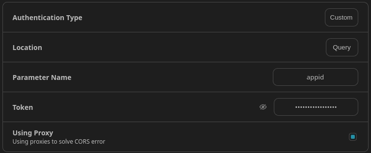
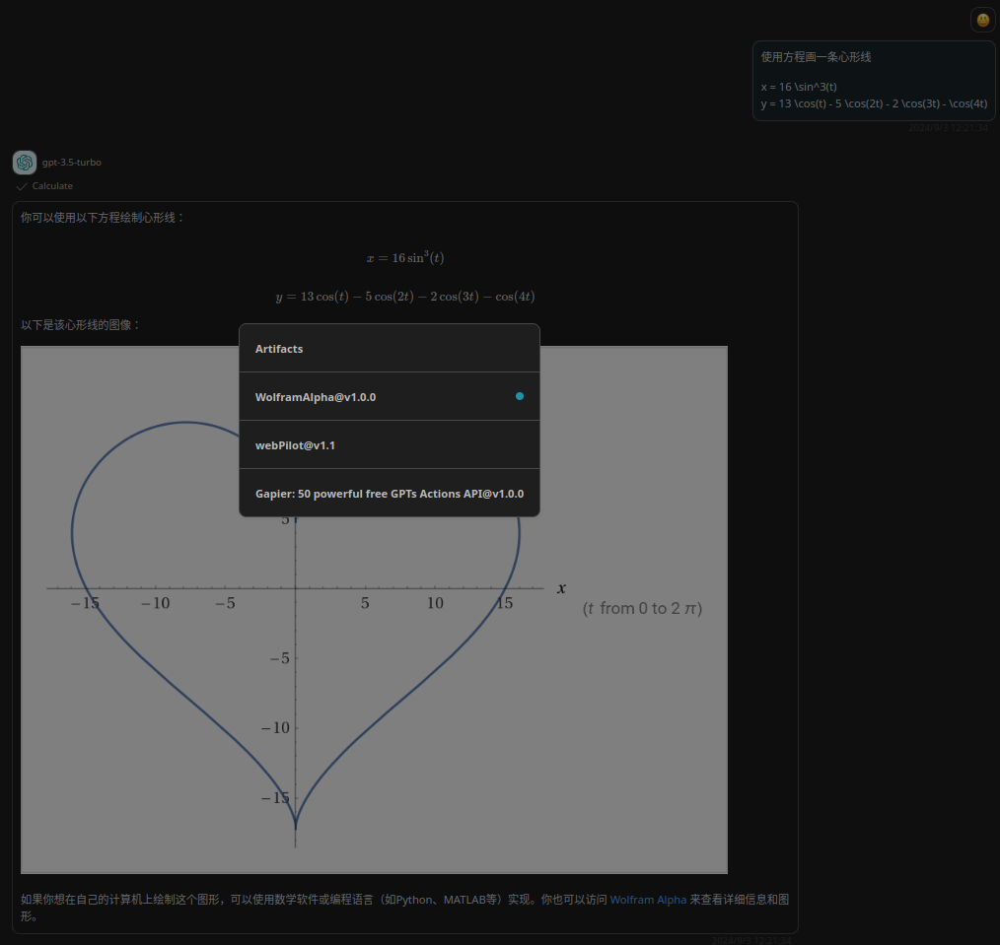

# WolframAlpha

> A wrapper around Wolfram Alpha. Useful for when you need to answer questions about Math, Science, Technology, Culture, Society and Everyday Life. Input should be a search query. If the result contains an image link, use the markdown syntax to return the image.

## Schema
[openapi.json](./openapi.json)

## Servers

`https://www.wolframalpha.com`

## Operations

1. Calculate
> `GET` /api/v1/llm-api?input=

## Authentication

type: custom
location: query
value: appid=`xxx`

## Preview

